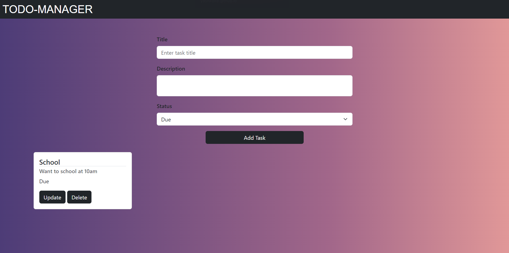

# Taskify

A simple web-based application to manage your tasks effectively. Taskify allows users to add, update, and delete tasks with ease.

## Features

- **Add Tasks:** Create a task by entering a title, description, and status (Due, Ongoing, Completed).
- **Update Tasks:** Edit an existing task's details.
- **Delete Tasks:** Remove a task from the list.
- **Dynamic Cards:** Each task is displayed as a card, making it visually appealing and easy to manage.

## Technologies Used

- **Frontend:**
  - HTML5
  - CSS3
  - Bootstrap 5
  - JavaScript (ES6)
- **Libraries:**
  - Bootstrap CDN for styling

## How to Use

1. **Clone the Repository:**
   ```bash
   git clone <repository_url>
   cd Taskify
   ```

2. **Open the Application:**
   Open the `index.html` file in your favorite browser.

3. **Add a Task:**
   - Enter the task title, description, and select the status from the dropdown.
   - Click the "Add Task" button to create a new task card.

4. **Update a Task:**
   - Click the "Update" button on a task card.
   - Modify the title and description in the input fields.
   - Click "Update Task" to save the changes.

5. **Delete a Task:**
   - Click the "Delete" button on the desired task card to remove it.

## Folder Structure

```
Taskify/
├── index.html          # Main HTML file
├── style.css           # Custom styles for the app
├── index.js            # Core JavaScript logic
└── README.md           # Project documentation
```

## Screenshots



## Credits

- **Developer:** Yash Kolte
- **Technologies:** Bootstrap, HTML, CSS, JavaScript

## License

This project is licensed under the MIT License - see the [LICENSE](LICENSE) file for details.
